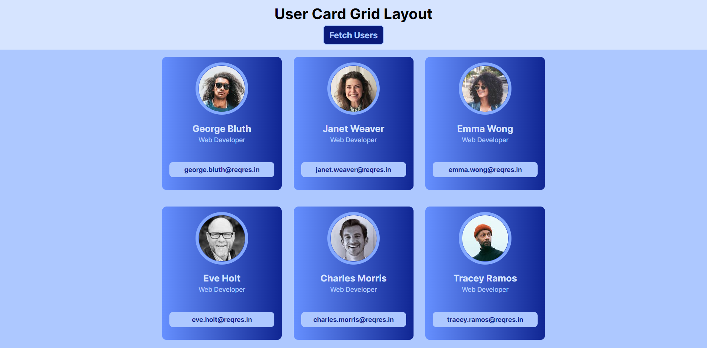

# LGMVIP-Web Virtual Internship Program — (1st Nov 2022 - 30th Nov 2022 )
  
  

### Project Task-2

**To Build a simple grid layout to showacse User Card/Profile Card using React.js and Reqres.in (API) as a part of my virtual internship provided by @LetsGrowMore as a Web Developer Intern. **

```bash

Task2: User Card/Profile Grid Layout
IDE: Visual Studio Code

```


[Live Demo URL](https://user-card-grid-layout-raivikas.vercel.app/)




### Project Overview

It consits of following Components:

* Header
* Loading
* UserCard

### Tech Stack Used

- HTML5
- CSS3
- JavaScript
- React.js (Front-End UI Library)
- Vercel (For Hosting the App)
- API Used (https://reqres.in/api/users?page=1)

### UI Resources Used

* SVG Icons - (Hero Icons by Tailwind CSS)
* Fonts (Inter)- (Google fonts)

### The Code

Steps to run the app locally:


#### Step-1: Git Clone the project

```bash
   git clone https://github.com/raiv200/TaskUpp.git
```

#### Step-2: Install the dependencies

```bash
  npm install
```


#### Step-3: Start the development server

Now open your project in your favorite IDE , (VsCode) and then start the development server.

```bash
   npm run start
```
